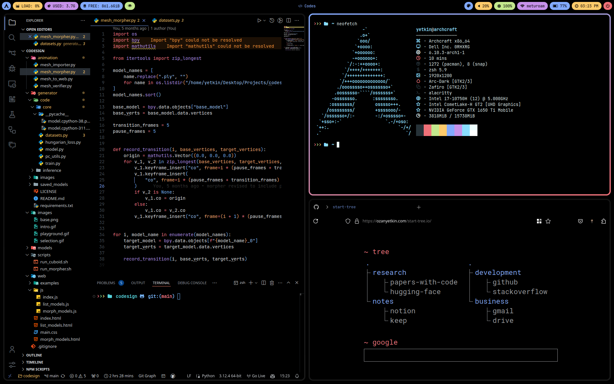

# archcraft-hyprland-config

.config files for archcraft hyprland



## Color Palette

```bash
# Colors
background='#000000'
foreground='#eeffff'
color0='#263238'
color1='#f07178'
color2='#c3e88d'
color3='#ffcb6b'
color4='#82aaff'
color5='#c792ea'
color6='#89ddff'
color7='#eeffff'
color8='#263238'
color9='#f07178'
color10='#c3e88d'
color11='#ffcb6b'
color12='#82aaff'
color13='#c792ea'
color14='#89ddff'
color15='#ffffff'
```
